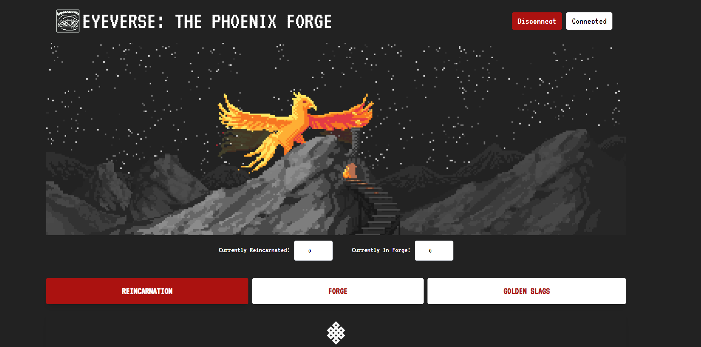
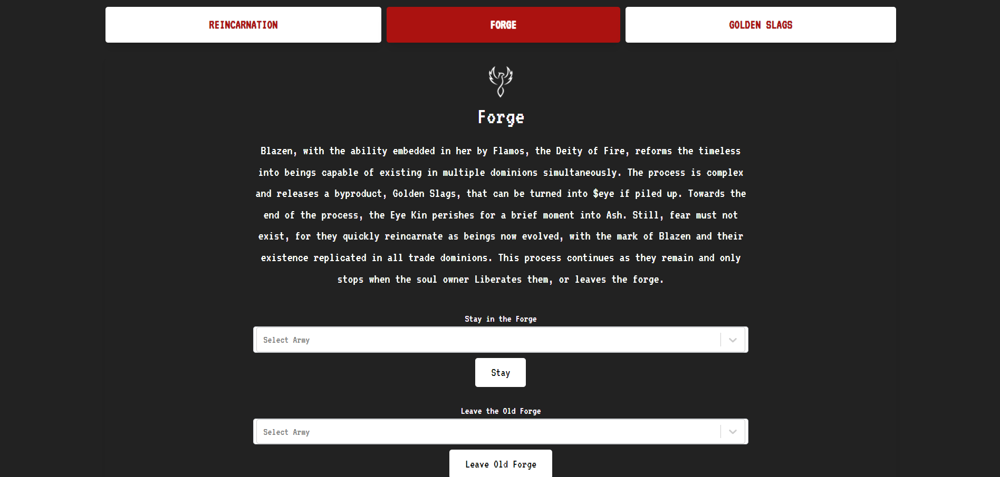
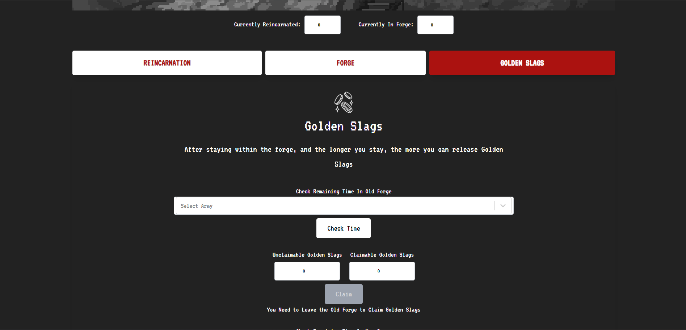

# Eyeverse NFT Staking DApp

Welcome to the official repository for the Eyeverse NFT Staking DApp, a groundbreaking project on the Ethereum blockchain, developed by Decypher Labs for our esteemed client. This platform offers a novel approach for NFT enthusiasts and investors to engage with Eyeverse NFTs by wrapping them into Reincarnated NFTs and staking them for rewards in Golden Slags. Leveraging the expertise of Decypher Labs in blockchain development, this DApp integrates seamlessly into the Eyeverse ecosystem, enhancing the utility and value of Eyeverse NFTs.

Explore the DApp live at: [Eyeverse Staking DApp](https://forge.eyeverse.world/)

## About Decypher Labs

Decypher Labs is at the forefront blockchain innovation, specializing in the development of decentralized applications that redefine user engagement and investment in the digital asset space. Our collaboration with the client to bring the Eyeverse NFT Staking DApp to life is a testament to our commitment to excellence and our passion for creating cutting-edge blockchain solutions.

## Features

- **NFT Wrapping**: Transform your Eyeverse NFTs into Reincarnated NFTs with enhanced attributes.
- **Staking for Rewards**: Earn Golden Slags by staking your Reincarnated NFTs, a valuable asset within the Eyeverse ecosystem.
- **User-Friendly Interface**: Designed for an intuitive and seamless staking experience.

## Getting Started

### Requirements

- A web3-enabled browser (e.g., Chrome with MetaMask, Brave, or Firefox with MetaMask).
- An Ethereum wallet with Eyeverse NFTs and a balance of ETH for transaction fees.

### Steps to Engage

1. **Connect Your Wallet**: Visit [Eyeverse Staking DApp](https://forge.eyeverse.world/) and connect your Ethereum wallet.

2. **Wrap Your NFTs**: Select the Eyeverse NFTs you wish to wrap into Reincarnated NFTs and confirm the transaction.

3. **Stake Reincarnated NFTs**: Choose your Reincarnated NFTs for staking and select the duration to earn Golden Slags.

4. **Claim Rewards**: After the staking period, claim your accumulated Golden Slags directly to your wallet.

## Interface Overview

The Eyeverse Staking DApp offers a user-friendly interface designed to make the process of wrapping, staking, and claiming rewards as straightforward as possible.

### Wrapping NFTs

Select your NFTs to wrap them into their Reincarnated forms, enhancing their attributes and rarity.

### Staking NFTs

Easily stake your Reincarnated NFTs and set your desired staking duration.

### Claiming Rewards

After the staking period ends, claim your Golden Slags rewards through a simple interface.

## Acknowledgments

This project was brought to fruition through the collaborative efforts of Decypher Labs and our client, showcasing the power of partnership in creating innovative solutions within the blockchain space. We extend our gratitude to everyone involved in making the Eyeverse NFT Staking DApp a reality.

Thank you for exploring the Eyeverse NFT ecosystem. Together with Decypher Labs and our client, we are forging a vibrant future for NFT engagement and investment.
